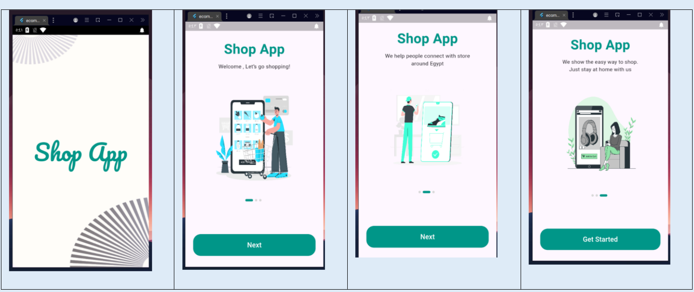
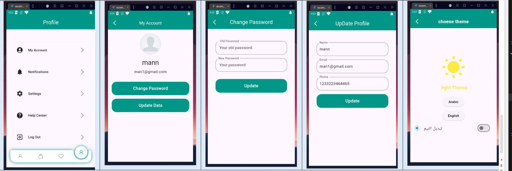

<!-- <!-- <!-- # E Commerce App -->

The Live Score application is a football sports application that presents the results of today's matches, team formations, and match events. It also allows arrangements for leagues and cups such as the English Premier League and the World Cup. -->

## E commerce  mockup

- Splash and OnBoarding screen

  
  
 - Auth Screen 
  
  
 - Home and details Feature    
    
 
- Favorite and Add Cart Screen Feature 

  
- Profile Screen Feature  

  
### Packages used in the project:

- [Dio](https://pub.dev/packages/dio)
- [internet_connection_checker](https://pub.dev/packages/internet_connection_checker)
- [equatable](https://pub.dev/packages/equatable)
- [dartz](https://pub.dev/packages/dartz)
- [bloc](https://pub.dev/packages/bloc)
- [flutter_bloc](https://pub.dev/packages/flutter_bloc)
- [hexcolor](https://pub.dev/packages/hexcolor)
- [get_it](https://pub.dev/packages/get_it)
- [intl](https://pub.dev/packages/intl)

### in the project:

- bloc as State managment
- Clean code
- Clean architecture
- [Restful api](https://www.api-football.com/documentation-v3) -->
