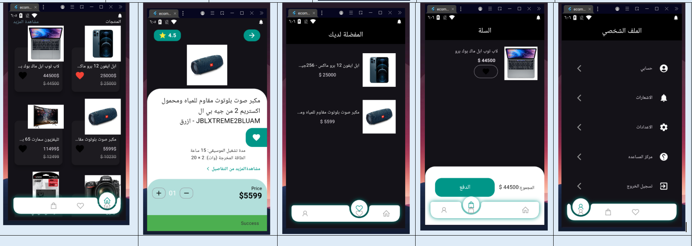

<!-- <!-- <!-- # E Commerce App -->
## E Commerce App

The E-Commerce App is a comprehensive and user-friendly solution designed to provide a seamless shopping experience. Users can browse a wide range of products, add items to favorites or the shopping cart, and complete purchases securely and efficiently. With a sleek design, multi-language support, dark mode, and advanced features like payment integration, this app is built to meet the needs of modern online shoppers. -->

## E commerce  mockup

- Splash and OnBoarding screen

  
  
 - Auth Screen 
  
  
 - Home and details Feature    

    
 
- Favorite and Add Cart Screen Feature 

  
- Profile Screen Feature  

- Payment Feature 

- Dark Mode Screen 

- localization Feature 

  
### Packages used in the project:

- [Dio](https://pub.dev/packages/dio)
- [internet_connection_checker](https://pub.dev/packages/internet_connection_checker)
- [equatable](https://pub.dev/packages/equatable)
- [dartz](https://pub.dev/packages/dartz)
- [bloc](https://pub.dev/packages/bloc)
- [flutter_bloc](https://pub.dev/packages/flutter_bloc)
- [flutter_localizations](https://pub.dev/packages/flutter_localization)
- [get_it](https://pub.dev/packages/get_it)
- [flutter_paypal_checkout](https://pub.dev/packages/flutter_paypal_checkout)
- [url_launcher](https://pub.dev/packages/url_launcher)
- [webview_flutter](https://pub.dev/packages/webview_flutter)

### in the project:

- bloc as State managment
- Clean code
- MVVM
- Restful api
= Localization 
